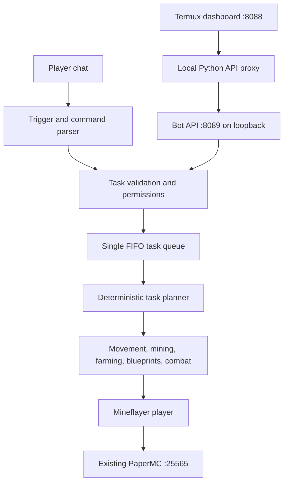

# Peppy Minecraft Bot

Peppy runs as a separate Mineflayer player process in Termux. It connects to the existing PaperMC server and does not install, start, configure, or create a Minecraft server or world.



## Install and Run

Run the installer in Termux. It installs Node.js and tmux when absent, downloads the bot modules, installs npm dependencies, and creates `~/.pocket-mc/mc-bot`. It does not touch PaperMC files or world data.

```bash
curl -fsSL https://raw.githubusercontent.com/5H45H1K1R4N/pocket-jellyfin/main/scripts/setup_minecraft_bot.sh | bash
nano ~/.pocket-mc/minecraft/bot/.env
~/.pocket-mc/mc-bot start
```

Management commands are `start`, `stop`, `restart`, `status`, and `attach`. Use `Ctrl+B`, then `D` to detach from the tmux console. The existing dashboard remains at port `8088`; its server-side proxy reaches the bot API at `127.0.0.1:8089`.

## Configuration

The installer copies `.env.example` to `.env` only when `.env` does not already exist. Keep `.env` private; it is ignored by Git.

```dotenv
MC_SERVER_HOST=127.0.0.1
MC_SERVER_PORT=25565
MC_BOT_USERNAME=Peppy
MC_BOT_AUTH=offline
MC_BOT_AUTOJOIN=true
MC_BOT_OWNER=YourMinecraftUsername
MC_BOT_ADMINS=
MC_BOT_PLAYERS=
AI_PROVIDER=gemini
GEMINI_API_KEY=
GEMINI_MODEL=gemini-1.5-flash
BOT_HTTP_PORT=8089
BOT_HTTP_HOST=127.0.0.1
```

Set `MC_SERVER_HOST` and `MC_SERVER_PORT` to the existing PaperMC address. `MC_BOT_AUTH=offline` only works when that server is configured with `online-mode=false`. Do not change the server setting just to make the bot connect; configure Mineflayer authentication to match the existing server instead. Microsoft authentication may require an interactive sign-in on first use. A password is not stored by this bot.

Set `MC_BOT_OWNER` to the exact Minecraft name. Optional comma-separated `MC_BOT_ADMINS` are administrators. If `MC_BOT_PLAYERS` is non-empty, unlisted names are guests; if empty, all other users receive the ordinary player role. Never put an API key in chat or in a committed file.

Gemini is optional. Without a key, the configured Gemini provider uses the local rule parser as fallback. Set `AI_PROVIDER=mock` for fully offline parsing. The LLM can return only structured tasks; the validator rejects unknown task types, unsupported blueprints/crops, invalid player names, hostile targets outside the allowlist, and mine amounts outside 1-256.

## Current Capabilities

Chat triggers are `Peppy`, `@peppy`, and `!peppy` at the beginning of a message. Current commands include:

- `help`, `status`, `health`, and `inventory`
- `follow me`, `follow <player>`, `come here`, and `stop`
- `mine <amount> <block>`; navigation and item pickup use Mineflayer pathfinding and collect-block
- `harvest <crop>`, `plant <crop>`, and `farm <crop>` for wheat, carrots, potatoes, beetroot, and sugar cane
- `build wheat_farm`, `build small_house`, and `build basic_storage` when required blocks are carried
- `attack <hostile mob>`, `defend`, and `cancel`

Tasks are validated and run one at a time. Cancel does not release the queue until the active skill returns. Builds refuse to replace any non-air block in the planned footprint and report incomplete placement as failure. Mining amounts count blocks mined; drops are collected but are not converted into a requested item count (for example, ore blocks and ore drops are different quantities).

## Permissions and API

Guests and players can request information; players can use basic movement and stop the bot, and can cancel their own active task. Mining, farming, building, combat, and defensive mode require the configured owner or an admin. Dashboard API requests are local trusted controls and do not carry an in-game player identity.

The bot HTTP API binds to `127.0.0.1` by default and accepts bounded, validated JSON commands. Keep it loopback-only; the dashboard proxies it. The existing dashboard itself may be reachable over LAN or a public tunnel, so do not treat loopback binding as authentication for the dashboard. Restrict public tunnel access separately.

## Resource Use and Limits

The bot is one Node.js process and is idle/event-driven apart from connection retries and task-local navigation. Retry delays increase from 5 to 10, 20, 40, then 60 seconds and are guarded against duplicate scheduling. It makes AI requests only for directed chat messages when a key is configured.

Crafting, smelting, container management, resource gathering for missing building materials, persistent autonomous self-reflection, and arbitrary user-authored structures are not implemented. The bot does not run an AI movement loop. Minecraft-version-specific behavior still requires a live PaperMC test; unit tests cannot prove a Mineflayer action against your world.

## Tests and Manual Check

Run non-Minecraft tests from the bot folder:

```bash
cd ~/.pocket-mc/minecraft/bot
npm test
```

Before enabling public access, verify on the existing server:

- [ ] Bot connects once as a player; PaperMC and Jellyfin remain healthy.
- [ ] A normal player can use status/follow/stop but cannot mine/build/attack.
- [ ] Owner can mine a disposable block and the dropped item reaches inventory.
- [ ] A build request refuses a non-empty area and does not replace blocks.
- [ ] Cancel stops a long mining/farming task before the next queued task starts.
- [ ] Bot reconnects after a controlled disconnect without duplicate sessions.
- [ ] Existing world, player data, plugins, and server configuration remain unchanged.